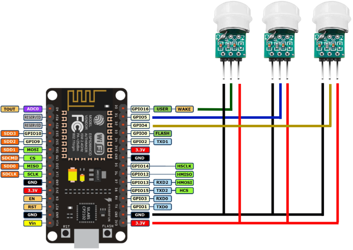

# Esp8266MotionSensor

This project uses `NodeMcu (ESP8266)` to detect movement with `3 motion sensors (Hailege AM312 )`. The state of the motion sensor is sent via `MQTT`. The project is ready for `Homeassistant` auto discovery.

## BOM (bill of materials)

- [NodeMCU ESP8266 WiFi Module](https://www.az-delivery.de/en/products/nodemcu-lolin-v3-modul-mit-esp8266)
- [2x Hailege AM312](https://www.amazon.de/Hailege-Pyroelectric-Sensor-Infrared-Detector/dp/B08C5572W4/ref=sr_1_5?__mk_de_DE=%C3%85M%C3%85%C5%BD%C3%95%C3%91&keywords=motion+sensor+infrared&sr=8-5)

## Wiring
- PowerSupply of the Motions Sensors: `3.3V`
- First Motion Sensor (Out Pin) is connceted  to `D0/GPIO16`
- Second Motion Sensor (Out Pin) is connceted  to `D1/GPIO5`
- Third Motion Sensor (Out Pin) is connceted  to `D2/GPIO4`
 
## Developing Environment

- [VS Code](https://code.visualstudio.com/) is used as IDE
- [PlatformIO](https://marketplace.visualstudio.com/items?itemName=platformio.platformio-ide) extension for building/uploading code
- 2 building enviorments:
  - `[env:nodemcuv2]`: using COM port to flash software
  - `[env:nodemcuv2_ota]`: using [ArduinoOTA](https://github.com/JAndrassy/ArduinoOTA) to flash over the air via WiFi

## Features

- [ArduinoOTA](https://github.com/JAndrassy/ArduinoOTA) to flashing OTA
- [Home Assistant auto discovery](https://www.home-assistant.io/integrations/mqtt/)
  - discovery topic: `homeassistant/binary_sensor/motion_sensor_floor_01/config`
    ```json
    {
      "name": "Motion Sensor Floor",
      "unique_id": "motion_sensor_floor_01",
      "device_class": "motion",
      "state_topic": "homeassistant/binary_sensor/motion_sensor_floor_01/state",
      "expire_after": "60"
    }
    ```
- send motion state via MQTT
  - state topic: `homeassistant/binary_sensor/motion_sensor_floor_01/state` (states: `OFF` or `ON`)

## Getting Started

1. install [VS Code](https://code.visualstudio.com/) and [PlatformIO](https://marketplace.visualstudio.com/items?itemName=platformio.platformio-ide) extension
2. enter secrets

   - rename `secrets_dummy.h` to `secrets.h`
   - enter your connection secrets

   ```c++
    // Wifi settings
    #define WIFI_SSID "";
    #define WIFI_PASSWORD ""

    // MQTT setting
    #define MQTT_SERVER ""
    #define MQTT_USER ""
    #define MQTT_PASSWORD ""
   ```

3. select `[env:nodemcuv2]` enviroment
4. `build` and `upload`
